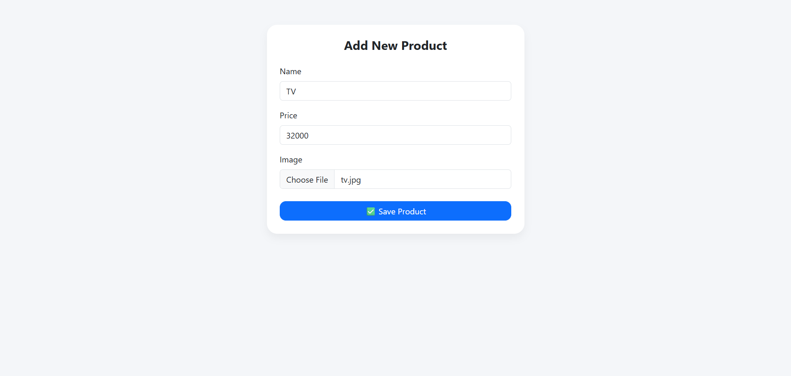
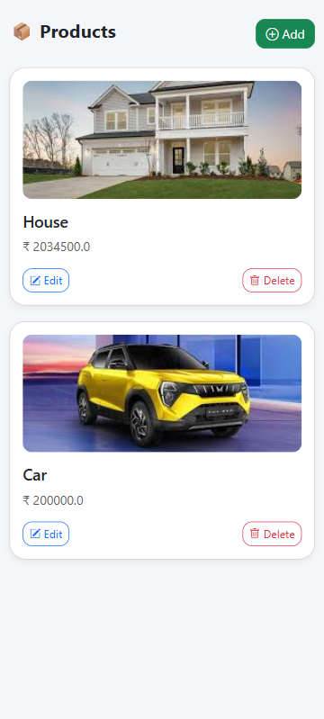

# 📦 Spring Boot CRUD Application with Image Upload

A complete **CRUD (Create, Read, Update, Delete)** application built using **Java Spring Boot**, **Thymeleaf**, **Bootstrap 5**, and **Spring Data JPA** with support for **image uploads** and a **mobile-friendly UI**.

---

## ✨ Features

- ✅ Add / Edit / Delete Products
- 🖼️ Upload and display product images
- 📱 Mobile-responsive layout using Bootstrap
- ⚡ Instant development with Spring Boot DevTools
- 💾 Store product data in **MySQL**
- 🧠 Learning-friendly project for beginners

---

## 🧰 Tech Stack Used

| Technology     | Purpose                             |
|----------------|-------------------------------------|
| Java           | Programming Language                |
| Spring Boot    | Backend Framework                   |
| Spring Web     | REST + MVC Support                  |
| Spring Data JPA| ORM / Database Layer                |
| Thymeleaf      | HTML Templating Engine              |
| Bootstrap 5    | Responsive & Modern UI              |
| H2 / MySQL     | Database (Dev & Prod)               |
| MultipartFile  | Image upload handling               |

---

## 📷 Screenshots

### 📱 Product List (Mobile UI)



### 📝 Add/Edit Product Form



---

## 🚀 How to Run Locally

### 1️⃣ Clone the Repository

```bash
git clone https://github.com/sudhir0603/springboot-crud-image.git
cd springboot-crud-image


```
### 📚 What I Learned
💡 How to build full CRUD in Spring Boot

💡 Handling file uploads with MultipartFile

💡 Using Thymeleaf with Bootstrap for responsive design

💡 Serving images dynamically

💡 Structuring a real-world Java application

💡 Making mobile-friendly UIs with Bootstrap


### 💻 Author
Made with ❤️ by Sudhir Kamble

Feel free to ⭐️ the repo or contribute.
